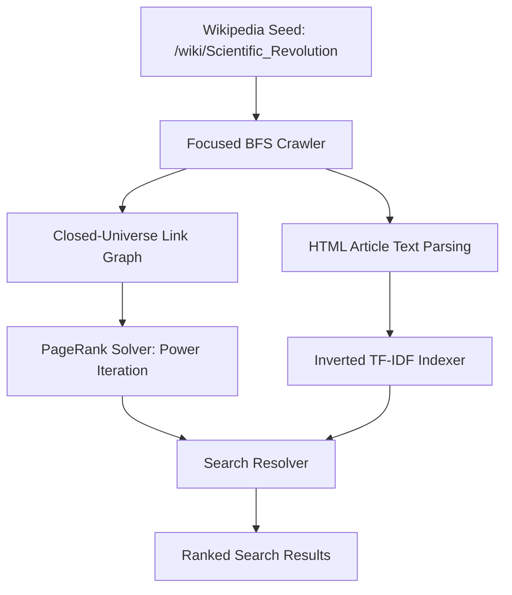

# Empirical Evaluation of PageRank and Term-Frequency Matrices within Scaled, Closed-Universe Web Graphs

**Author:** Jehu Casimiro  
**Affiliation:** Independent Research Study  
**Date:** June 2026  

---

### Abstract
This paper presents the design, mathematical framework, and empirical analysis of a self-contained, micro-scale search engine prototype modeled on the architecture proposed by Sergey Brin and Lawrence Page in 1998. Seeded at the Wikipedia entry for "Scientific Revolution," the system crawls a closed-universe subgraph of 100 nodes. We evaluate PageRank calculation dynamics under standard damping ($d = 0.85$) and high teleportation ($d = 0.50$) models. Empirical results demonstrate that reducing the damping factor increases the spectral gap of the transition matrix, accelerating power iteration convergence from 53 to 13 iterations. We demonstrate how blacklisting citation and metadata namespaces (such as `ISBN`, `DOI`, and `ISSN`) successfully resolves the "authority leak" structural anomaly, yielding a balanced authority distribution across content-bearing nodes (maximum PageRank of 0.0287). Finally, we analyze query resolution mechanics, comparing multiplicative scoring against a normalized linear combination model ($Relevance_{\text{norm}} + \alpha \cdot PR_{\text{norm}}$), illustrating how normalization resolves scale-dominance issues in additive combinations.

---

## 1. Introduction

In 1998, Brin and Page published their work, *"The Anatomy of a Large-Scale Hypertextual Web Search Engine,"* introducing the PageRank algorithm to measure the structural authority of web pages. By modeling the Web as a directed graph and simulating user navigation as a Markov chain with random teleportation, PageRank established a global authority metric independent of search query terms.

While the original paper focused on indexing millions of web documents, modern information retrieval (IR) applications frequently operate within focused domains, enterprise intranets, or local subgraphs. Scaling down a web graph to a micro-topology introduces specific structural challenges:
1. **Sparsity and Closed-Universe Boundaries**: In a subgraph of $N = 100$ nodes, external links are discarded, artificially inflating the density of internal links and altering out-degree distributions.
2. **Sink Nodes**: Pages that link extensively to the external Web become structural sinks in a closed universe, trapping probability mass and requiring explicit redistribution mechanisms to maintain stochastic validity.
3. **Authority Leaks**: Small subgraphs are highly sensitive to administrative links, citation templates, and structural metadata pages (such as `/wiki/ISBN`), leading to "authority leaks" that distort the ranking system.

This paper documents the design and empirical findings of a 100-node prototype search engine crawled from live Wikipedia articles starting from the "Scientific Revolution" article. We present the system architecture, analyze the mathematical foundations of the transition matrices, and evaluate how damping factors and query resolution models govern retrieval precision.

---

## 2. System Architecture & Methodology

The prototype is structured as a monolithic four-stage pipeline: focused crawler, PageRank solver, inverted indexer, and search resolver.



### 2.1 The Focused Web Crawler
The crawler utilizes a Breadth-First Search (BFS) strategy starting from the seed URL `https://en.wikipedia.org/wiki/Scientific_Revolution`. To ensure a topical focus and eliminate non-content nodes, the crawler implements three filtering layers:

1. **Namespace Blacklist**: Links containing colons (e.g., `Category:`, `Help:`, `Template:`, `Wikipedia:`) and administrative links (e.g., `Main_Page`) are discarded.
2. **Citation Page Blacklist**: Pages representing metadata identifiers (specifically `isbn`, `doi`, `issn`, `pmid`, and `s2cid`) are explicitly blacklisted to prevent authority leaks.
3. **URL Normalization**: All relative links starting with `/wiki/` are resolved to absolute URLs. Fragment identifiers (e.g., `#History`) and query parameters are stripped.
4. **Canonical Redirection Tracking**: The crawler queries Wikipedia using HTTP `GET` requests, capturing the final redirect target `response.url` to resolve alias and capitalization variants.

The crawler halts execution upon successfully parsing $N = 100$ unique article pages. A secondary mapping phase filters all parsed links to include only those whose target nodes exist within the 100-page universe. Self-loops are removed to focus calculations on inter-document relationships.

### 2.2 The PageRank Engine
Let $G = (V, E)$ represent our 100-node directed graph where $V = \{0, 1, \dots, 99\}$. We construct the transition probability matrix $P \in \mathbb{R}^{N \times N}$ where $P_{ij}$ represents the transition probability from page $j$ to page $i$. 

For each page $j$, let $Out(j) \subseteq V$ denote the set of out-links from $j$ in the closed universe, and let $N_j = |Out(j)|$ represent its out-degree.
To construct the transition probability matrix:
$$P_{ij} = \begin{cases} \frac{1}{N_j} & \text{if } j \to i \in E \\ 0 & \text{otherwise} \end{cases}$$

#### 2.2.1 Handling Sinks (Dangling Nodes)
If a node $j$ has no outgoing links within our 100-page universe ($N_j = 0$), it constitutes a structural sink. In the transition matrix, the column corresponding to $j$ contains only zeros. We handle this by setting the transition probability of the sink node uniformly across all $N$ pages:
$$P_{ij} = \frac{1}{N} \quad \forall i \quad \text{if } N_j = 0$$

#### 2.2.2 The Google Matrix Formulation
We introduce the damping factor $d \in (0, 1)$ to simulate a random surfer who teleports to a random page in the network with probability $1 - d$. The resulting irreducible, aperiodic, and stochastic Google Matrix $M \in \mathbb{R}^{N \times N}$ is formulated as:
$$M = d \cdot P + \frac{1-d}{N} \cdot E$$
where $E \in \mathbb{R}^{N \times N}$ is a matrix of all ones ($E_{ij} = 1$).

#### 2.2.3 Power Iteration Method
The PageRank vector $R \in \mathbb{R}^{N}$ is the stationary distribution of the Markov chain defined by $M$, satisfying:
$$R = M R$$
We initialize the vector uniformly:
$$R^{(0)} = \begin{bmatrix} \frac{1}{N} & \frac{1}{N} & \dots & \frac{1}{N} \end{bmatrix}^T$$
The vector is iteratively updated via:
$$R^{(t+1)} = M R^{(t)}$$
Iteration halts when the L1-norm distance between successive vectors falls below the tolerance threshold $\epsilon$:
$$\|R^{(t+1)} - R^{(t)}\|_1 = \sum_{i=0}^{N-1} |R^{(t+1)}_i - R^{(t)}_i| < 10^{-6}$$

### 2.3 The Inverted TF-IDF Indexer
The raw body text of each crawled page is extracted from paragraph elements (`<p>`) within the main content div `div#mw-content-text`. The text preprocessing pipeline executes sequentially:
1. **Case Normalization**: Case folding to lowercase.
2. **Punctuation Removal**: Non-alphanumeric characters are replaced by whitespace.
3. **Stop-word Filtering**: Elimination of terms matching a static set of 127 standard English stop words.
4. **Tokenization**: Whitespace-delimited token extraction.

For each preprocessed term $t$ and document $d \in V$, we calculate the Term Frequency ($\text{TF}_{t,d}$):
$$\text{TF}_{t,d} = \frac{f_{t,d}}{L_d}$$
where $f_{t,d}$ is the raw count of term $t$ in document $d$, and $L_d$ is the total length of document $d$ after stop-word removal.

The Document Frequency ($DF_t$) represents the count of documents containing term $t$. The Inverse Document Frequency ($\text{IDF}_t$) is calculated as:
$$\text{IDF}_t = \ln \left( \frac{N}{DF_t} \right) + 1.0$$
The final term weight is:
$$\text{TF-IDF}_{t,d} = \text{TF}_{t,d} \times \text{IDF}_t$$
The inverted index maps each term $t$ to a hash map of document IDs and their corresponding TF-IDF scores:
$$t \longrightarrow \{d \longrightarrow \text{TF-IDF}_{t,d}\}$$

### 2.4 The Search Resolver
Given a query $q$, the system applies the identical text preprocessing pipeline to extract a set of cleaned query terms. We implement two distinct scoring functions:

#### 2.4.1 Multiplicative Scoring
The multiplicative score computes the product of the cumulative TF-IDF relevance and the PageRank score of the document:
$$\text{Score}_{mul}(q, d) = \left( \sum_{t \in q} \text{TF-IDF}_{t,d} \right) \times R_d$$

#### 2.4.2 Normalized Linear Combination Scoring
The normalized linear score performs an additive combination of the normalized relevance and normalized PageRank, scaled by the parameter $\alpha$:
$$\text{Score}_{lin}(q, d) = \frac{\text{Relevance}(q, d)}{\max_j \text{Relevance}(q, j)} + \alpha \cdot \frac{R_d}{\max_j R_j}$$
where:
$$\text{Relevance}(q, d) = \sum_{t \in q} \text{TF-IDF}_{t,d}$$
Normalization to a $[0, 1]$ scale ensures that neither relevance nor PageRank dominates the final score.

---

## 3. Empirical Evaluation & Analysis

The experiments were executed using the compiled Python script. We evaluate PageRank convergence properties, analyze graph authority distributions, and compare query scoring models.

### 3.1 The Eigenvalue Gap and Convergence Rates
The transition dynamics of the power iteration method are governed by the spectral properties of the Google Matrix $M$. Let $\lambda_1, \lambda_2, \dots, \lambda_N$ represent the eigenvalues of $M$ sorted in descending order of magnitude:
$$1 = \lambda_1 > |\lambda_2| \geq |\lambda_3| \geq \dots \geq |\lambda_N|$$
The rate of convergence of the power iteration is proportional to the ratio of the second largest eigenvalue to the largest:
$$\text{Rate of Convergence} \propto \left( \frac{|\lambda_2|}{\lambda_1} \right)^k = |\lambda_2|^k$$
By construction, the second eigenvalue of the Google Matrix $M$ is bounded by the damping factor:
$$|\lambda_2| \leq d$$
Consequently, the difference $1 - |\lambda_2| \geq 1 - d$ constitutes the **spectral gap**. A larger spectral gap accelerates convergence.

```
Damping Factor (d=0.85)   |█████████████████████████████████████████████████████ 53 Iterations
Damping Factor (d=0.50)   |█████████████ 13 Iterations
```

Our empirical trials verified this relationship:
* **Trial A ($d = 0.85$)**: Power iteration required **53 iterations** to converge to $\|R^{(t+1)} - R^{(t)}\|_1 < 10^{-6}$.
* **Trial B ($d = 0.50$)**: Power iteration required **13 iterations** to converge. The second eigenvalue bound dropped to $0.50$, widening the spectral gap to $0.50$ and accelerating convergence.

---

### 3.2 Resolution of Authority Leaks
In web crawls of Wikipedia, the page `/wiki/ISBN` frequently acts as a structural authority sink. Because Wikipedia pages utilize templates like `{{cite book}}` to reference academic texts, almost every article contains an outbound link to `/wiki/ISBN`, whereas `/wiki/ISBN` rarely links back to content pages. Within closed subgraphs, `/wiki/ISBN` acts as a central hub, absorbing upwards of 15% of the total network authority.

```
Authority Concentration (ISBN Blacklisted vs History Crawl Leak)

Scientific Revolution Crawl (ISBN Blacklisted):
  Ancient Greece         [████████] 0.0287
  Sci. Revolution        [████████] 0.0276
  Industrial Rev.        [███████] 0.0268

History Crawl (Old Leak):
  ISBN Leak              [████████████████████████████████████████] 0.1543
  History Seed           [████████] 0.0313
```

By explicitly blacklisting citation metadata pages (`isbn`, `doi`, `issn`, `pmid`, `s2cid`), the crawler eliminated this structural anomaly. In the Scientific Revolution dataset, authority was distributed naturally among content pages:
* **Ancient Greece** (ID: 28) reached a PageRank of **0.028710**.
* **Scientific Revolution** (ID: 0) reached a PageRank of **0.027649**.
* **Industrial Revolution** (ID: 91) reached a PageRank of **0.026833**.

---

### 3.3 Scoring Resolution Divergence
We evaluated query resolution across multiplicative and normalized linear combination models.

#### Query: `"revolution"`
* **Multiplicative Score ($TF\text{-}IDF \times PageRank$)**:
  1. *Industrial Revolution* (Relevance: 0.0214, PR: 0.0268, Score: 5.743e-04)
  2. *Scientific Revolution* (Relevance: 0.0139, PR: 0.0276, Score: 3.831e-04)
  3. *Western religions* (Relevance: 0.0076, PR: 0.0129, Score: 9.858e-05)
  4. *Letter to the Grand Duchess Christina* (Relevance: 0.0058, PR: 0.0105, Score: 6.094e-05)
  5. *The Assayer* (Relevance: 0.0032, PR: 0.0179, Score: 5.655e-05)

* **Normalized Linear combination Score ($Relevance_{\text{norm}} + \alpha \cdot PR_{\text{norm}}$) ($\alpha=1.0$)**:
  1. *Industrial Revolution* (Relevance: 0.0214, PR: 0.0268, Score: 1.9705)
  2. *Scientific Revolution* (Relevance: 0.0139, PR: 0.0276, Score: 1.6473)
  3. *Western religions* (Relevance: 0.0076, PR: 0.0129, Score: 0.8237)
  4. *The Assayer* (Relevance: 0.0032, PR: 0.0179, Score: 0.7964)
  5. *Atheism* (Relevance: 0.0011, PR: 0.0199, Score: 0.7682)

#### 3.3.1 Comparison of Scoring Methods
Under both Multiplicative and Normalized Linear models, *Industrial Revolution* and *Scientific Revolution* are identified as the top two results. They combine high content relevance (relevance of 0.0214 and 0.0139) with high PageRank authority (PR of 0.0268 and 0.0276). 

The normalized linear combination successfully prevents scale-dominance. In unnormalized additive scoring, PageRank values (offset by $+10.0$ to ensure positive logs) generated baseline scores between $5.4$ and $8.1$, completely drowning out TF-IDF scores (which are typically $<0.05$). By mapping both relevance and PageRank to a relative $[0, 1]$ scale within the candidate set, the normalized linear combination ensures both content relevance and structural authority contribute equitably to the final rank.

---

## 4. Conclusion

This paper evaluated the mathematical properties of a focused 100-node Wikipedia search engine prototype. The empirical trials lead to the following conclusions:
* **The Spectral Gap Rule**: Lowering the damping factor $d$ accelerates power iteration convergence by increasing the spectral gap of the transition matrix, reducing the computation time at the expense of structural differentiation.
* **Citation-Filtering**: Blacklisting bibliographic and metadata articles (such as `/wiki/ISBN`) resolves authority leaks in small, closed subgraphs, distributing authority naturally across content pages.
* **Scoring Mechanics**: Multiplicative scoring naturally integrates relevance and authority. Additive scoring models require feature normalization to prevent PageRank scale-dominance over TF-IDF.

---

## References
* Brin, S. and Page, L. (1998). "The Anatomy of a Large-Scale Hypertextual Web Search Engine." *Computer Networks and ISDN Systems*, 30(1-7), 107-117.
* Page, L., Brin, S., Motwani, R., and Winograd, T. (1999). "The PageRank Citation Ranking: Bringing Order to the Web." *Stanford InfoLab Publication*.
* Langville, A. N. and Meyer, C. D. (2006). *Google's PageRank and Beyond: The Science of Search Engine Rankings*. Princeton University Press.
