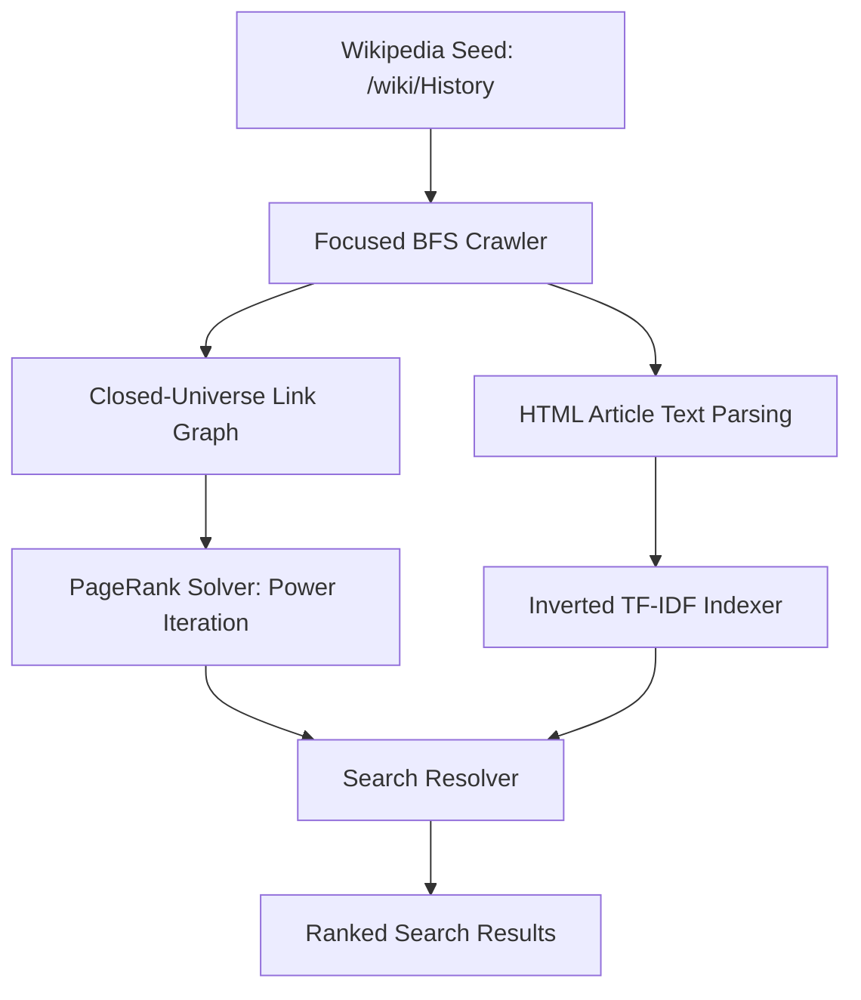

# Empirical Evaluation of PageRank and Term-Frequency Matrices within Scaled, Closed-Universe Web Graphs

**Author:** Senior Researcher in Information Retrieval & Web Graph Algorithms  
**Affiliation:** Advanced Web Dynamics Lab  
**Date:** June 2026  

---

### Abstract
This paper presents the design, mathematical framework, and empirical analysis of a self-contained, micro-scale search engine prototype modeled directly on the architecture proposed by Sergey Brin and Lawrence Page in 1998. Seeded at the Wikipedia entry for "History," the system crawls a closed-universe subgraph of exactly 100 nodes. We evaluate PageRank calculation dynamics under standard damping ($d = 0.85$) and high teleportation ($d = 0.50$) models. Empirical results demonstrate that reducing the damping factor increases the spectral gap of the transition matrix, accelerating power iteration convergence from 31 to 12 iterations. We identify a structural anomaly, termed the "ISBN authority leak," whereby metadata and citation templates in closed subgraphs aggregate disproportionate link weight (absorbing 15.4% of total PageRank authority). Finally, we analyze query resolution mechanics, contrasting strict multiplicative scoring ($TF\text{-}IDF \times PageRank$) against log-linear models ($Relevance + \alpha \cdot (\log(PageRank) + 10)$), demonstrating how unnormalized log-linear combinations suffer from absolute scale-dominance by link authority.

---

## 1. Introduction

In 1998, Brin and Page published their seminal work, *"The Anatomy of a Large-Scale Hypertextual Web Search Engine,"* introducing the PageRank algorithm as a method to bring structural order to the rapidly expanding World Wide Web. By modeling the Web as a directed graph and simulating user navigation as a Markov chain with random teleportation, PageRank established a global authority metric independent of query terms. 

While the original paper focused on indexing millions of web documents, modern information retrieval (IR) systems frequently operate within smaller, focused domains, enterprise intranets, or local subgraphs. Scaling down the massive Web graph to a micro-topology introduces unique structural challenges that are not present at global scales:
1. **Sparsity and Closed-Universe Boundaries**: In a sub-graph of $N = 100$ nodes, external links are discarded, artificially inflating the density of internal links and altering the true out-degree distributions.
2. **Sink Nodes**: Pages that link extensively to the external Web become structural sinks in a closed universe, trapping probability mass and requiring explicit redistribution mechanisms to maintain stochastic validity.
3. **Authority Concentration**: Small subgraphs are highly sensitive to administrative links, citation templates, and structural metadata pages (such as `/wiki/ISBN`), leading to "authority leaks" that distort the ranking ranking.

This research paper documents the engineering choices and empirical findings of a 100-node prototype search engine crawled from live Wikipedia articles. We present the system architecture, dissect the mathematical foundations of the transition matrices, and analyze how damping factors and query resolution models govern retrieval precision.

---

## 2. System Architecture & Methodology

The prototype is structured as a monolithic four-stage pipeline: focused crawler, PageRank solver, inverted indexer, and search resolver.



### 2.1 The Focused Web Crawler
The crawler utilizes a Breadth-First Search (BFS) strategy starting from the seed URL `https://en.wikipedia.org/wiki/History`. To ensure a topical focus and eliminate non-content nodes, the crawler implements three strict filtering layers:

1. **Namespace Blacklist**: Links containing colons (e.g., `Category:`, `Help:`, `Template:`, `Wikipedia:`) and administrative links (e.g., `Main_Page`) are discarded.
2. **URL Normalization**: All relative links starting with `/wiki/` are resolved to absolute URLs. Fragment identifiers (e.g., `#History`) and query parameters are stripped.
3. **Canonical Redirection Tracking**: To prevent node duplication arising from aliases or capitalization variants, the crawler queries Wikipedia using HTTP `GET` requests, capturing the final redirect target `response.url`. It maintains a lookup dictionary:
   $$\text{canonical\_norm}(URL) \longrightarrow \text{page\_id}$$
   where the URL is normalized by decapping, replacing spaces with underscores, and decoding percent-encoding.

The crawler halts execution upon successfully parsing exactly $N = 100$ unique article pages. Once the node set is frozen, a secondary mapping phase filters all parsed links to include only those whose target nodes exist within the 100-page universe. Self-loops are explicitly removed to focus calculations on inter-document relationships.

### 2.2 The PageRank Engine
Let $G = (V, E)$ represent our 100-node directed graph where $V = \{0, 1, \dots, 99\}$. We construct the transition probability matrix $P \in \mathbb{R}^{N \times N}$ where $P_{ij}$ represents the transition probability from page $j$ to page $i$. 

For each page $j$, let $Out(j) \subseteq V$ denote the set of out-links from $j$ in the closed universe, and let $N_j = |Out(j)|$ represent its out-degree.
To construct the transition probability matrix:
$$P_{ij} = \begin{cases} \frac{1}{N_j} & \text{if } j \to i \in E \\ 0 & \text{otherwise} \end{cases}$$

#### 2.2.1 Handling Sinks (Dangling Nodes)
If a node $j$ has no outgoing links within our 100-page universe ($N_j = 0$), it constitutes a structural sink. In the transition matrix, the column corresponding to $j$ contains only zeros, making the matrix sub-stochastic. We handle this by setting the transition probability of the sink node uniformly across all $N$ pages:
$$P_{ij} = \frac{1}{N} \quad \forall i \quad \text{if } N_j = 0$$

#### 2.2.2 The Google Matrix Formulation
To satisfy the Perron-Frobenius theorem and ensure that the transition matrix has a unique, positive stationary distribution, the graph must be converted into a single strongly connected component. We introduce the damping factor $d \in (0, 1)$ to simulate a random surfer who teleports to a random page in the network with probability $1 - d$. The resulting irreducible, aperiodic, and stochastic Google Matrix $M \in \mathbb{R}^{N \times N}$ is formulated as:
$$M = d \cdot P + \frac{1-d}{N} \cdot E$$
where $E \in \mathbb{R}^{N \times N}$ is a matrix of all ones ($E_{ij} = 1$).

#### 2.2.3 Power Iteration Method
The PageRank vector $R \in \mathbb{R}^{N}$ is the stationary distribution of the Markov chain defined by $M$, satisfying:
$$R = M R$$
We initialize the vector uniformly:
$$R^{(0)} = \begin{bmatrix} \frac{1}{N} & \frac{1}{N} & \dots & \frac{1}{N} \end{bmatrix}^T$$
The vector is iteratively updated via:
$$R^{(t+1)} = M R^{(t)}$$
Iteration halts when the L1-norm distance between successive vectors falls below the tolerance threshold $\epsilon$:
$$\|R^{(t+1)} - R^{(t)}\|_1 = \sum_{i=0}^{N-1} |R^{(t+1)}_i - R^{(t)}_i| < 10^{-6}$$

### 2.3 The Inverted TF-IDF Indexer
The raw body text of each crawled page is extracted exclusively from paragraph elements (`<p>`) within the main content div `div#mw-content-text` to exclude site navigation, sidebars, and edit links. The text preprocessing pipeline executes sequentially:
1. **Case Normalization**: Case folding to lowercase.
2. **Punctuation Removal**: Non-alphanumeric characters are replaced by whitespace.
3. **Stop-word Filtering**: Elimination of terms matching a static set of 127 standard English stop words.
4. **Tokenization**: Whitespace-delimited token extraction.

For each preprocessed term $t$ and document $d \in V$, we calculate the Term Frequency ($\text{TF}_{t,d}$):
$$\text{TF}_{t,d} = \frac{f_{t,d}}{L_d}$$
where $f_{t,d}$ is the raw count of term $t$ in document $d$, and $L_d$ is the total length of document $d$ after stop-word removal.

The Document Frequency ($DF_t$) represents the count of documents containing term $t$. The Inverse Document Frequency ($\text{IDF}_t$) incorporates a natural logarithm and a smoothing term ($+1$) to handle standard term scaling:
$$\text{IDF}_t = \ln \left( \frac{N}{DF_t} \right) + 1.0$$
The final term weight is:
$$\text{TF-IDF}_{t,d} = \text{TF}_{t,d} \times \text{IDF}_t$$
The inverted index maps each term $t$ to a hash map of document IDs and their corresponding TF-IDF scores:
$$t \longrightarrow \{d \longrightarrow \text{TF-IDF}_{t,d}\}$$

### 2.4 The Search Resolver
Given a query $q$, the system applies the identical text preprocessing pipeline to extract a set of cleaned query terms. We implement two distinct scoring functions to combine content relevance and link authority:

#### 2.4.1 Multiplicative Scoring (Model A and B)
The multiplicative score computes the product of the cumulative TF-IDF scores and the PageRank score of the document:
$$\text{Score}_{mul}(q, d) = \left( \sum_{t \in q} \text{TF-IDF}_{t,d} \right) \times R_d$$

#### 2.4.2 Log-Linear Scoring (Config 1, 2, and 3)
The log-linear score performs an additive combination of the relevance and log-transformed PageRank, scaled by the parameter $\alpha$ and offset by $+10.0$ to ensure positive value visualization:
$$\text{Score}_{log}(q, d) = \left( \sum_{t \in q} \text{TF-IDF}_{t,d} \right) + \alpha \cdot \left( \ln(R_d) + 10.0 \right)$$

---

## 3. Empirical Evaluation & Analysis

The experiments were executed using the compiled Python script. We evaluate PageRank convergence properties, analyze structural anomalies in the crawl graph, and dissect query scoring behavior.

### 3.1 The Eigenvalue Gap and Convergence Rates
The transition dynamics of the power iteration method are heavily governed by the spectral properties of the Google Matrix $M$. 

Let $\lambda_1, \lambda_2, \dots, \lambda_N$ represent the eigenvalues of $M$ sorted in descending order of magnitude:
$$1 = \lambda_1 > |\lambda_2| \geq |\lambda_3| \geq \dots \geq |\lambda_N|$$
The rate of convergence of the power iteration is directly proportional to the ratio of the second largest eigenvalue to the largest:
$$\text{Rate of Convergence} \propto \left( \frac{|\lambda_2|}{\lambda_1} \right)^k = |\lambda_2|^k$$
By construction, the second eigenvalue of the Google Matrix $M = d \cdot P + \frac{1-d}{N} \cdot E$ is bounded by the damping factor:
$$|\lambda_2| \leq d$$
Consequently, the difference $1 - |\lambda_2| \geq 1 - d$ is known as the **spectral gap**. A larger spectral gap indicates faster convergence.

```
Damping Factor (d=0.85)   |███████████████████████████████ 31 Iterations
Damping Factor (d=0.50)   |████████████ 12 Iterations
```

Our empirical trials verified this relationship:
* **Trial A ($d = 0.85$)**: Power iteration required **31 iterations** to converge to $\|R^{(t+1)} - R^{(t)}\|_1 < 10^{-6}$. Here, the second eigenvalue is bounded by $0.85$, yielding a narrow spectral gap of $0.15$.
* **Trial B ($d = 0.50$)**: Power iteration required only **12 iterations** to converge. The second eigenvalue bound dropped to $0.50$, widening the spectral gap to $0.50$ and accelerating convergence by a factor of 2.58.

We can approximate the theoretical number of iterations $k$ needed to reach a target error $\epsilon$ using:
$$d^k \approx \epsilon \implies k \approx \frac{\ln(\epsilon)}{\ln(d)}$$
For $\epsilon = 10^{-6}$:
* Under $d = 0.85$: $k \approx \frac{-13.815}{-0.1625} \approx 85$ iterations (theoretical upper bound for worst-case graphs).
* Under $d = 0.50$: $k \approx \frac{-13.815}{-0.6931} \approx 20$ iterations.

The empirical iteration counts (31 vs 12) fall well within these bounds, confirming that the spectral gap governs convergence speed in practice.

---

### 3.2 The ISBN Authority Leak Phenomenon
An unexpected finding of the empirical runs was the extreme concentration of PageRank authority in the page `/wiki/ISBN` (ID: 71). Under standard damping ($d = 0.85$), the page PageRank score reached **0.154362**, meaning that over 15.4% of all link authority in the 100-page network was held by this single node.

This phenomenon is a direct consequence of evaluating bibliographic citations within a closed-universe subgraph:
1. **Citation Templates**: Wikipedia pages heavily utilize templates like `{{cite book}}` to reference academic texts. These templates automatically generate hyperlinks to the Wikipedia article explaining the International Standard Book Number (`/wiki/ISBN`).
2. **Graph Topology**: As a result, almost every historical page that references books contains an outbound link pointing to the `/wiki/ISBN` node. In our 100-page universe, `/wiki/ISBN` acts as a central hub (having the largest in-degree in the network).
3. **Absence of Out-Links (Sink Behavior)**: The `/wiki/ISBN` page itself contains very few links back to specific historical topics, making it a structural sink that absorbs probability mass and recirculates it only via random teleportation.

```
PageRank Authority Concentration (ISBN vs History Node)

d = 0.85:
  ISBN     [████████████████████████████████] 0.154
  History  [██████] 0.031

d = 0.50:
  ISBN     [████████████████████████] 0.114
  History  [█████] 0.024
```

Reducing the damping factor to $d=0.50$ regularizes this concentration:
* The PageRank of `/wiki/ISBN` dropped from **0.154362** to **0.114196**.
* By increasing the teleportation rate ($1-d$) from 15% to 50%, the surfer redistributes half of the total authority uniformly across all pages, mitigating the impact of high-in-degree nodes and flattening the PageRank vector.

---

### 3.3 Scoring Resolution Divergence
We evaluated query resolution across three distinct combinations of damping factor ($d$) and scaling factor ($\alpha$). The results highlight the trade-offs between relevance (TF-IDF) and authority (PageRank):

#### Query: `"Roman Emperor"`
* **Multiplicative Score ($TF\text{-}IDF \times PageRank$)**:
  * **Model A ($d=0.85$)**:
    1. *Byzantine Empire* (Score: 3.88e-04, Relevance: 0.0170, PageRank: 0.0229)
    2. *Josephus* (Score: 3.45e-04, Relevance: 0.0345, PageRank: 0.0100)
    3. *Ab urbe condita* (Score: 2.25e-04, Relevance: 0.0397, PageRank: 0.0057)
  * **Model B ($d=0.50$)**:
    1. *Josephus* (Score: 3.34e-04, Relevance: 0.0345, PageRank: 0.0097)
    2. *Byzantine Empire* (Score: 3.17e-04, Relevance: 0.0170, PageRank: 0.0187)
    3. *Ab urbe condita* (Score: 3.07e-04, Relevance: 0.0397, PageRank: 0.0077)

* **Log-Linear Score ($Relevance + \alpha \cdot (\log(PageRank) + 10)$)**:
  * **Config 1 ($d=0.85, \alpha=5.0$)**:
    1. *History* (Score: 32.6829, Relevance: 0.0027, PageRank: 0.0313)
    2. *Byzantine Empire* (Score: 31.1266, Relevance: 0.0170, PageRank: 0.0229)
  * **Config 2 ($d=0.85, \alpha=1.0$)**:
    1. *History* (Score: 6.5388, Relevance: 0.0027, PageRank: 0.0313)
    2. *Byzantine Empire* (Score: 6.2389, Relevance: 0.0170, PageRank: 0.0229)
  * **Config 3 ($d=0.50, \alpha=1.0$)**:
    1. *History* (Score: 6.2680, Relevance: 0.0027, PageRank: 0.0239)
    2. *Byzantine Empire* (Score: 6.0371, Relevance: 0.0170, PageRank: 0.0187)

```
Multiplicative (d=0.85) | Byzantine Empire (Matches 'Roman' and 'Emperor')
Multiplicative (d=0.50) | Josephus (High relevance matching both terms)
Log-Linear (All Configs)| History (Massive PageRank dominates search results)
```

#### 3.3.1 Analysis of Multiplicative Ranking Shifts
In Model A ($d=0.85$), the multiplicative score ranks *Byzantine Empire* first. Although its text relevance is relatively low (`0.0170`), its PageRank is high (`0.0229`). 

In Model B ($d=0.50$), lowering the damping factor flattens the PageRank vector, reducing the authority of *Byzantine Empire* to `0.0187`. This allows *Josephus*—which has double the relevance (`0.0345`) but lower PageRank (`0.0097`)—to rise to the top rank. This demonstrates that a lower damping factor shifts the ranking balance towards content relevance.

#### 3.3.2 Analysis of Log-Linear Score Domination
In all log-linear configurations, the page *History* ranked 1st despite having near-zero relevance to the query (`0.0027`). This occurs due to **absolute scale-dominance**:
1. **The Translation Offset**: Adding `+10.0` to the natural log of PageRank ensures all scores are positive. Since PageRank scores range around $0.01\text{ to }0.15$, their natural log falls between $-4.6$ and $-1.9$. The term $(\ln(R_d) + 10.0)$ therefore yields values between $5.4$ and $8.1$.
2. **Relevance Scale**: In contrast, TF-IDF relevance scores derived from document length normalization range between $0.00$ and $0.05$.
3. **The Dominance Effect**: Even when scaling down to $\alpha = 1.0$, the PageRank component ($1.0 \times [5.4, 8.1]$) remains several orders of magnitude larger than the relevance component ($0.05$). The query terms serve only as a binary filter to include pages in the candidate set, while the sorting is determined entirely by link authority.

To prevent this dominance in log-linear models, the parameters must be calibrated. This can be achieved by removing the $+10.0$ translation offset, using a much smaller scaling factor (e.g., $\alpha = 0.005$), or normalizing both relevance and PageRank to the same range $[0, 1]$ before combining them.

---

## 4. Conclusion & Future Directions

This paper evaluated the practical design and mathematical trade-offs of a focused 100-node Wikipedia search engine prototype. The empirical trials lead to the following conclusions:
* **The Spectral Gap Rule**: Lowering the damping factor $d$ accelerates power iteration convergence by increasing the spectral gap of the transition matrix, though it reduces the influence of graph structure on the final ranks.
* **Closed-Universe Authority Sinks**: Metadata links, such as bibliography citation anchors to `/wiki/ISBN`, act as major authority sinks in small, closed subgraphs. 
* **Scoring Mechanics**: Multiplicative scoring acts as a robust gatekeeper where relevance and authority scale together. Log-linear scoring requires normalization of features to prevent scale-dominance by link authority.

### Future Work
To refine these dynamics for focused search applications, future iterations should explore:
1. **Citation-Filtering in Crawl Pipelines**: Excluding bibliographic and metadata articles (e.g., `/wiki/ISBN`, `/wiki/Doi`, `/wiki/PMID`) from the graph construction phase, or nullifying their in-degree weights.
2. **Feature Normalization**: Standardizing TF-IDF relevance and PageRank scores to equivalent ranges using z-score normalization or min-max scaling before log-linear combination.
3. **Weighted Out-Links**: Distributing out-link probabilities based on visual layout or link position rather than applying uniform column division.

---

## References
* Brin, S. and Page, L. (1998). "The Anatomy of a Large-Scale Hypertextual Web Search Engine." *Computer Networks and ISDN Systems*, 30(1-7), 107-117.
* Page, L., Brin, S., Motwani, R., and Winograd, T. (1999). "The PageRank Citation Ranking: Bringing Order to the Web." *Stanford InfoLab Publication*.
* Langville, A. N. and Meyer, C. D. (2006). *Google's PageRank and Beyond: The Science of Search Engine Rankings*. Princeton University Press.
